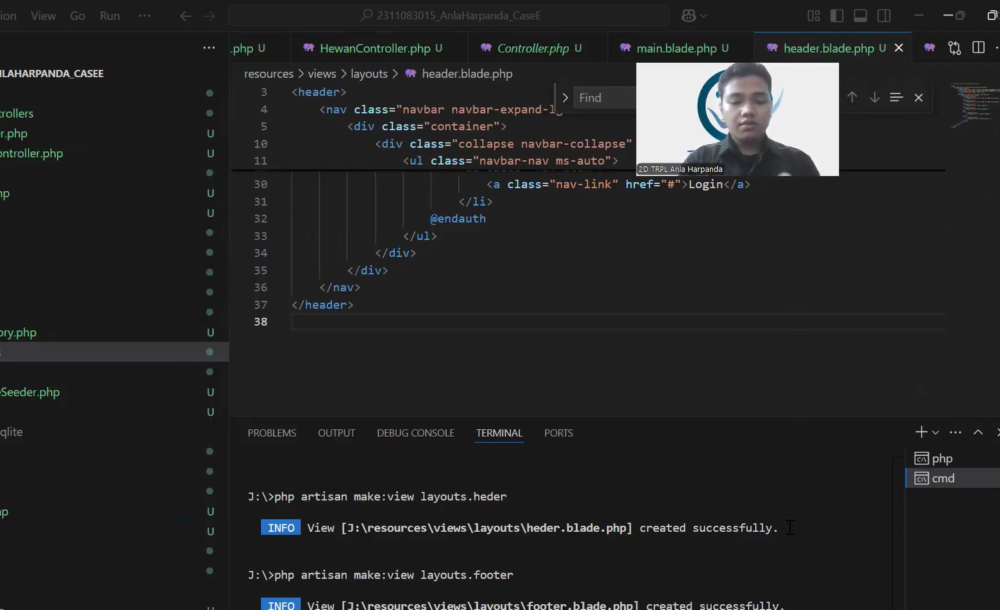

<table>
  <tr>
    <td align="center">
      <br/>membuat project laravel<br>00:24
    </td>
    <td align="center">
      <br/>Membuat Database Baru<br>02:48s
    </td>
    <td align="center">
      <br/>Membuat migration<br>05:22
    </td>
  </tr>
  <tr>
    <td align="center">
      <br/>Membuat model & eloquent ORM<br>06:24
    </td>
    <td align="center">
      <br/>Membuat Controller & Validasi setiap input<br>08:27
    </td>
    <td align="center">
      <br/>Membuat view (index, create, update, trashed)<br>09:20
    </td>
  </tr>
  <tr>
    <td align="center">
      <br/>Membuat Router<br>11:46
    </td>
    <td align="center">
      <br/>Memperbaiki error di laravel<br>12:29
    </td>
    <td align="center">
      <br/>Tampilan awal tanpa isi tabel<br>14:46
    </td>
  </tr>
  <tr>
    <td align="center">
      <br/>Memembuat factory dan seeder dg faker<br>15:17
    </td>
    <td align="center">
      <br/>Memembuat pagination 10 data<br>18:31
    </td>
    <td align="center">
      <br/>Hasil Halaman Index<br>19:04
    </td>
  </tr>
  <tr>
    <td align="center">
      <br/>Hasil Halaman Tambah Data<br>19:17
    </td>
    <td align="center">
      <br/>Hasil Halaman Edit data<br>20:24
    </td>
    <td align="center">
      <br/>Hasil halaman data hewan dihapus<br>20:36
    </td>
  </tr>
  <tr>
    <td align="center">
      <br/>Hasil Fitur pulihkan data sampah<br>21:00
    </td>
    <td align="center">
      <br/>Hasil Fitur Hapus Permanen<br>21:14
    </td>
    <td align="center">
      <br/>Kode untuk validasi data input & edit<br>24:11
    </td>
  </tr>
  <tr>
    <td align="center">
      <br/>Review Akhir<br>24:30
    </td>
    <td align="center">
      <br/>Push hasil ke Github<br>24:48
    </td>
    <td align="center">
      <br/>Penutup <br>25:43
    </td>
  </tr>
</table>

---
<div align="center">
  <b><h1>UTS Pemprograman Web Framework</h1></b>
</div>

# News Application

Aplikasi ini menggunakan dua framework utama:

## Struktur Direktori

```
- assets/                              # Folder untuk menyimpan gambar
  - 
- 2311083015_AnlaHarpanda_CaseE/       # Folder Project Laravel
  - ...
- Video_AnlaHarpanda_Zoom.mp4          # File Video MP4 Menggunakan Zoom
```

---
